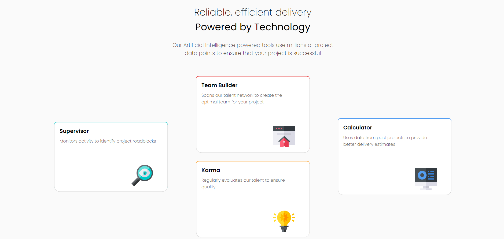
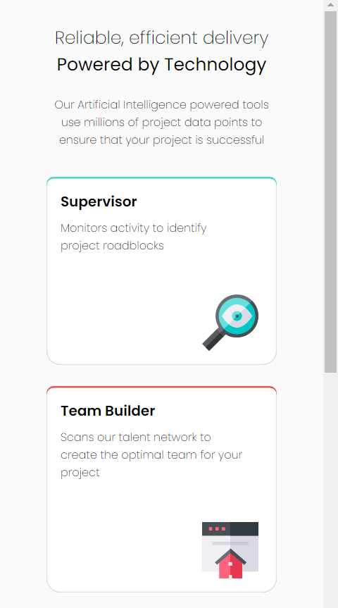

# Frontend Mentor - Four card feature section solution

This is a solution to the [Four card feature section challenge on Frontend Mentor](https://www.frontendmentor.io/challenges/four-card-feature-section-weK1eFYK). Frontend Mentor challenges help you improve your coding skills by building realistic projects.

## Table of contents

-   [The challenge](#the-challenge)
-   [Screenshot](#screenshot)
-   [Links](#links)
-   [Built with](#built-with)
-   [Author](#author)

## The challenge

Users should be able to:

-   View the optimal layout for the site depending on their device's screen size

## Screenshot

### Links

-   Solution URL: (https://github.com/tarikdincer/Four-Card-Feature)
-   Live Site URL: (https://tarikdincer.github.io/Four-Card-Feature/)

## Built with

-   Semantic HTML5 markup
-   CSS custom properties
-   Flexbox
-   Mobile-first workflow

## Author

-   Frontend Mentor - [@tarikdincer](https://www.frontendmentor.io/profile/tarikdincer)
